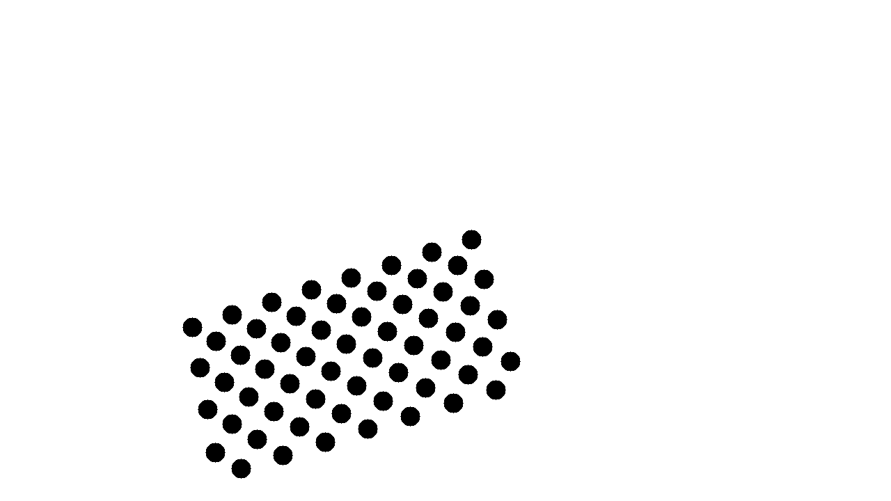

# Intrinsic Calibration for a single camera with Ceres

This repository contains methods to perform an intrinsic camera calibration for pinhole-cameras (with optional distortion estimation) with Ceres as optimization backend. 

It's essentially a reimplementation of cv::calibrateCamera and its main purpose is to learn how to use Ceres in computer vision. 

To see how it works, check the test-data in [calib_images](./calib_images) and the test-cases [test_full.cpp](./src/tests/test_full.cpp).

We assume that in every image, at most one view of a calibration target with distinctice features is visible and the metric position of those features are known. One possible choice for such a pattern is a flat target like a checkerboard or circle pattern. [BTW: Such a pattern can be made for low cost and acceptable accuracy by printing on Aludibond. We ordered simply at PosterXXL, a print-service that specialized on customized posters or wallart] 

For the Ceres-Residual check the [PatternViewReprojectionError](./include/ceres_calibration/pattern_view_reprojection_error.h). This class represents the projection of a single pattern into a single view. It takes the current estimation of the pattern pose relative to the camera and the intrinsic calibration of the camera to project the pattern's features into the camera image. For each feature, the squared distance in pixels to the actual observed image is computed and added to the error vector. 

## IntrinsicCalibration
Main class of this repo is the [IntrinsicCalibration](./include/ceres_calibration/ceres_intrinsic_calib.h). This class contains functions to load images with pattern observations or synthetic test data, compute an initial estimate for the focal length and setting up and running the ceres-based optimization. Estimation of the distortion (plumb-bob model with five parameters) is optional. This base class only assumes a pattern with known metric size and is purely virtual. For each pattern (checkerboard, circles grid, ...), a class has to be derived that
knows how to extract the observed pixel positions from an image. So far, only a class that can process the OpenCV asymmetric circle pattern is implemented (OpenCVAsymmetricCircleGridCalibration), 

## Initial estimation of focal length
A good initial guess for all optimized parameters is important because the optimization otherwise could fail completely, get stuck in a local minimum or take quite long to converge to the optimum. 
We estimate a good initial focal length by estimating the pose of the pattern in the first image of the dataset by calling cv::solvePNP for a range of values and use the best focal length. 
This focal length is then used to estimate the initial pose for all views. 
This approach works nicely (even though cv::solvePNP is a black box) and creates a suprisingly well initial parameterization, but takes some seconds to set up. 

## Comparison to cv::calibrateCamera
This implementation finds very similar values to cv::calibrateCamera. The cause of the deviation is not clear, it would be interesting to find out, if it is only a numerical difference caused by different optimization approaches. (We did not look at the original implementation yet to build an independent solution).

## Test data generation
The [SynthCircleProjectionsGenerator](./include/ceres_calibration/synth_circle_projections_generator.h)-class can be used to create synthetic image data. It projects the asymmetric OpenCV pattern at random poses into the camera image and stores an image in which circles are drawn at each position as well as a yaml-file with the pixel-accurate positions. The pose of each pattern and the used intrinsic and distortion and other required parameters are also stored. Example for such yaml-file can be found [here](./calib_images/synth/info.yml).

## Tests
Check [test_full.cpp](./src/tests/test_full.cpp) for some gtest-testcases which are also a good way to understand how to use this library. 